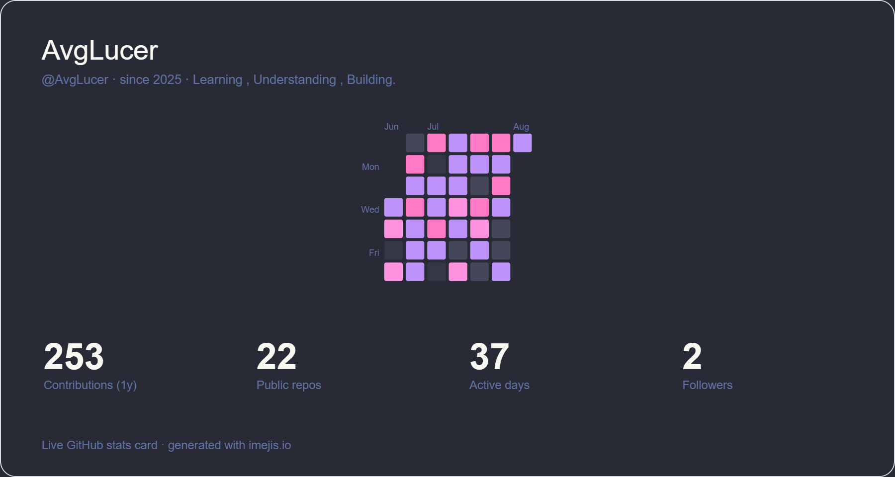

# ⚡ AvgLucer | Gaurav W

### Founder & CEO — Glox Industries

`Python Developer` • `AI / ML` • `Data Science` • `Software Builder`

---

## 💫 About Me

🐍 Developing Python projects ranging from small utilities to larger applications.
📚 Learning new Python libraries and frameworks every day.
📊 Exploring Data Analytics, Machine Learning, and AI.
🌐 Building modern web applications and automation tools.
💡 Writing clean, maintainable, and well-documented code.

**Currently focused on:** `DSA` • `AI/ML` • `Python` • `Data` • `Software Engineering`

---

## 🧰 Tech Stack

### Languages

### Web

### Data & Visualization

### Python Libraries

---

## 📊 GitHub Analytics

---

## 📈 Contribution Activity

<picture>
  <source media="(prefers-color-scheme: dark)" srcset="github-contribution-animation.svg" />
  
</picture>

## 🛰️ GitHub Statistics

---

## 🏆 Achievements

---

## 🌐 Connect With Me

---

### `Building Software With a New Vision.`

